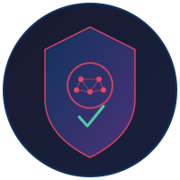

<p align="center">
  
</p>

<h1 align="center">CISO Approval Bot</h1>

<p align="center">
  <strong>AI-powered security request triage for Slack + Jira + Confluence</strong>
</p>

<p align="center">
  <a href="#features">Features</a> &bull;
  <a href="#how-it-works">How It Works</a> &bull;
  <a href="#quick-start">Quick Start</a> &bull;
  <a href="#configuration">Configuration</a> &bull;
  <a href="#triage-prompt">Triage Prompt</a> &bull;
  <a href="#license">License</a>
</p>

---

## Features

- **Monitors a Slack channel** for messages containing Jira tickets or Confluence pages
- **Fetches ticket/page data** from Atlassian APIs (Jira REST v3, Confluence REST v2)
- **Classifies requests** using Claude AI into risk levels: `LOW`, `MEDIUM`, `HIGH`, `MISSING_INFO`
- **Auto-approves** LOW and MEDIUM requests directly in Slack threads
- **Escalates** HIGH-risk requests to the CISO with a detailed risk summary
- **Asks clarifying questions** for incomplete submissions — in both Slack and Jira comments
- **Re-evaluates** requests when new information is provided in threads
- **Resolves Confluence short links** (`/wiki/x/CODE`) to full page IDs
- **Runs on a schedule** via macOS `launchd` (every 5 minutes by default)

## How It Works

```
Slack Channel (#approvals)
        │
        ▼
   ┌─────────┐     ┌──────────────┐     ┌───────────┐
   │  Bot     │────▶│  Jira /      │────▶│  Claude   │
   │  polls   │     │  Confluence  │     │  classifies│
   │  channel │     │  fetch data  │     │  request   │
   └─────────┘     └──────────────┘     └─────┬─────┘
                                              │
                    ┌─────────────────────────┬┴──────────────────┐
                    ▼                         ▼                   ▼
              LOW / MEDIUM                  HIGH             MISSING_INFO
              Auto-approve            Escalate to CISO      Ask questions
              in thread               with risk summary     in Slack + Jira
```

## Quick Start

### Prerequisites

- Python 3.9+
- A Slack workspace with a bot app ([create one](https://api.slack.com/apps))
- Atlassian Cloud account with API token
- Anthropic API key

### Slack App Permissions

Your Slack bot needs these OAuth scopes:

| Scope | Purpose |
|-------|---------|
| `channels:history` | Read messages in the approval channel |
| `chat:write` | Post triage responses in threads |
| `groups:history` | Read messages if using a private channel |

### Installation

```bash
git clone https://github.com/YOUR_USERNAME/ciso-approval-bot.git
cd ciso-approval-bot
chmod +x setup.sh
./setup.sh
```

The setup script will:
1. Create a Python virtual environment
2. Install dependencies
3. Copy `.env.example` to `.env` (if not present)
4. Create a macOS `launchd` plist for scheduled execution

### Configure

Edit `.env` with your credentials:

```bash
# Slack
SLACK_BOT_TOKEN=xoxb-...
SLACK_CHANNEL_ID=C0XXXXXXXXX
CISO_SLACK_ID=U0XXXXXXXXX       # Slack ID of the person to escalate to
BOT_SLACK_ID=U0XXXXXXXXX        # Slack ID of this bot

# Anthropic
ANTHROPIC_API_KEY=sk-ant-...
CLAUDE_MODEL=claude-sonnet-4-20250514

# Atlassian
ATLASSIAN_EMAIL=you@example.com
ATLASSIAN_API_TOKEN=...
ATLASSIAN_DOMAIN=yourorg.atlassian.net

# Jira
JIRA_PROJECT_KEY=SEC             # Your Jira project prefix
```

### Run

**Manual (one-shot):**
```bash
source venv/bin/activate
python bot.py
```

**As a service (macOS launchd):**
```bash
launchctl load ~/Library/LaunchAgents/com.ciso-approval-bot.plist
```

**Check logs:**
```bash
tail -f logs/bot.log
```

## Configuration

| Environment Variable | Required | Description |
|---------------------|----------|-------------|
| `SLACK_BOT_TOKEN` | Yes | Slack bot OAuth token |
| `SLACK_CHANNEL_ID` | Yes | Channel to monitor |
| `CISO_SLACK_ID` | Yes | Slack user ID for escalations |
| `BOT_SLACK_ID` | No | Bot's own Slack user ID (for dedup) |
| `ANTHROPIC_API_KEY` | Yes | Claude API key |
| `CLAUDE_MODEL` | No | Claude model (default: `claude-sonnet-4-20250514`) |
| `ATLASSIAN_EMAIL` | Yes | Atlassian account email |
| `ATLASSIAN_API_TOKEN` | Yes | Atlassian API token |
| `ATLASSIAN_DOMAIN` | Yes | e.g. `yourorg.atlassian.net` |
| `JIRA_PROJECT_KEY` | No | Jira project prefix (default: `SEC`) |

## Triage Prompt

The classification prompt lives in [`prompts/triage_system_prompt.md`](prompts/triage_system_prompt.md). You can customize the decision criteria, risk thresholds, and output format to match your organization's security policies.

Variables `{CISO_SLACK_ID}` and `{BOT_SLACK_ID}` are substituted at runtime from your `.env`.

## Project Structure

```
ciso-approval-bot/
├── bot.py                          # Main application
├── setup.sh                        # Installation & launchd setup
├── requirements.txt                # Python dependencies
├── .env.example                    # Environment variable template
├── .gitignore
├── prompts/
│   └── triage_system_prompt.md     # Claude system prompt (customizable)
├── assets/
│   └── logo.svg                    # Project logo
├── logs/                           # Runtime logs (gitignored)
├── processed_requests.json         # State file (gitignored)
├── LICENSE
├── CONTRIBUTING.md
└── README.md
```

## Deployment Alternatives

While this project ships with a macOS `launchd` setup, you can run it anywhere:

- **cron** — `*/5 * * * * cd /path/to/bot && venv/bin/python bot.py`
- **systemd** — create a `.service` + `.timer` unit
- **Docker** — wrap in a container with a cron entrypoint
- **AWS Lambda / Cloud Functions** — trigger on a CloudWatch/Scheduler schedule

## License

[Apache 2.0](LICENSE)

---

<p align="center">
  Built with <a href="https://docs.anthropic.com/claude/docs">Claude API</a> &bull;
  <a href="https://api.slack.com/">Slack SDK</a> &bull;
  <a href="https://developer.atlassian.com/cloud/jira/platform/rest/v3/">Atlassian REST API</a>
</p>
